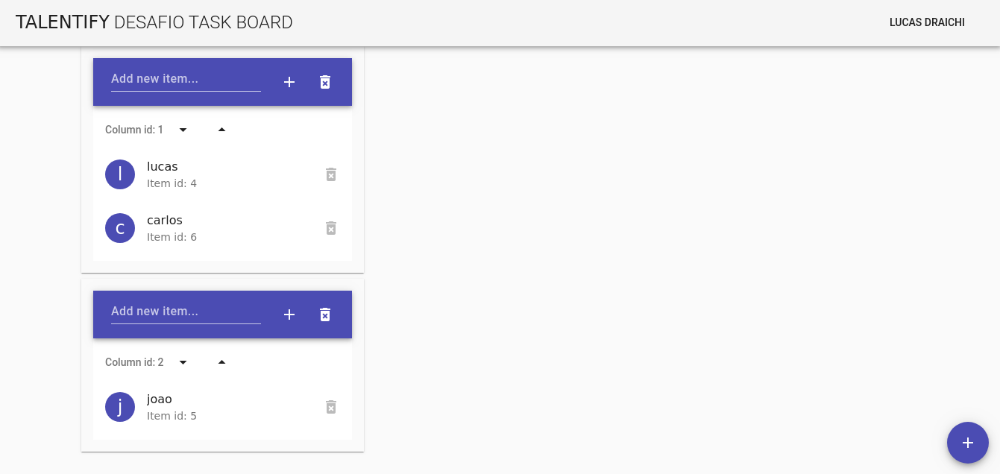

# Desafio task board - Lucas Draichi

## Project setup

```
npm i
npm run serve
```

## Specs

Tested on:
- Ubuntu 16.04
- Node 10.15.3
- Vue-CLI 3.5.1

## External libs

- Vuetify
- Vuex
- Vue Dragger

> Em `src/store/index.js:3` o seguinte `import 'es6-promise/auto'` é para dar suporte ao IE9+



> Build na pasta `dist`

## Objetivo

_Utilizando Vue.js, criar um web app que permitirá ao usuário criar e re-ordenar múltiplas listas de tarefa._

1. App deve ser iniciado com 1 coluna vazia
1. App deverá permitir que o usuário:
    - Adicione, remova, reordene tarefas
    - Adicione, remova, reordende colunas
    - Mova tarefa entre diferentes colunas
    - Ordene as tarefas de uma coluna alfabeticamente
1. Id e texto das tarefas devem estar sempre visíveis


**Tempo estimado:** 2h ~ 3h

## Detalhes

- É permitido utilizar frameworks e bibliotecas javascript/css
- Os dados **não** precisam ser persistidos
- Funcionalidade e qualidade do código são mais importantes que aparência, então não gaste muito tempo com css
- Bônus por compatibilidade com IE9+

## Instruções

1. Faça um fork do repositório
1. Desenvolva sua solução
1. Abra uma pull-request com a solução final

Lembretes:
- Enviar os arquivos originais e compilados
- Preferencialmente, a solução deve funcionar como entregue e sem depender de programas externos (docker, banco de dados, ...)
- Caso sua solução precise de instruções para ser executada, detalhar o passo-a-passo na pull-request ou readme
